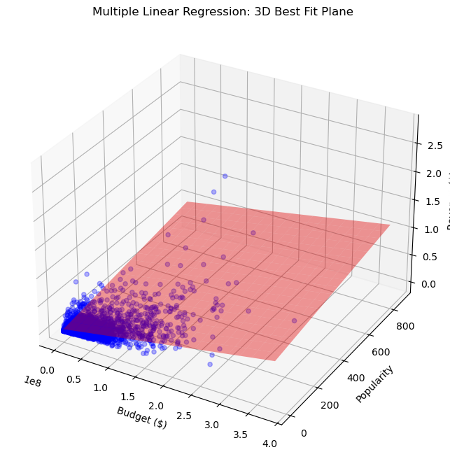

# TMDB-Movie-Revenue-Prediction-using-Multiple-Linear-Regression-using-Python---ML
# 🎬 Movie Revenue Prediction (Multiple Linear Regression)

## 📌 Project Overview
Can we predict a movie's global revenue before it hits theaters? This project implements a **Multiple Linear Regression (MLR)** model to estimate movie earnings based on historical data. By analyzing factors like budget, popularity, and user ratings, the model identifies the "Best Fit Plane" that represents the relationship between production costs and financial success.

### 🔑 Key Features
* **Automated Data Fetching**: Integrated with `kagglehub` for seamless dataset updates.
* **3D Visualization**: Visualizes the regression hyperplane against Budget and Popularity.
* **Model Persistence**: Saves the trained model using `joblib` for instant inference on unknown data.
* **Comprehensive Metrics**: Trackable performance using R², MAE, and RMSE.

---

## 📊 Dataset
The project uses the **TMDB 5000 Movie Dataset** via Kaggle.
* **Target Variable**: `revenue`
* **Features**: `budget`, `popularity`, `runtime`, `vote_average`, `vote_count`.

